<h1> RESET BALI </h1>
<h3> Full stack project - PP4 </h3>

The RESET BALI application showcases an "oasis of peace" in the form of three wellness programmes. The programmes consist of a number of activities including yoga, meditation and guided hikes. 

Link to live website here

<h1> Table of Contents </h1>

- Project Summary
- User Experience (UX)
  - User stories
  - The Strategy plane
  - The Scope plane
  - The Structue plane
  - The Skeleton plane
    - Site Mockup
 - Features
 - Existing Features
 - Future Features
 - Testing
 - Deployment
 - Credits

<h1> User Experience (UX) </h1>

<h2> User Stories </h2>

 - As a first time user, I want to easily navigate the site.
 - As a first time user, I want to be informed about the different programmes on offer.
 - As a first time user, I want to read testimonials from previous customers.
 - As a first time user, I want to register an account on the site.

- As a returning user, I want to log into my account.
- As a returning user, I want to reserve a spot on an upcoming program.
- As a returning user, I want to be able to contact the company.
- As a returning user, I want to submit a review.
 

<h2> The Strategy Plane </h2>

Reset Bali is a web application that informs the user of a wellness retreat based in two locations in Bali. The user can choose between the two locations, each location offering a different program, the reset, rewind and renew program. The user will be able to create an account, read reviews left by previous attendees and also book their slot in an upcoming programme of their choice. 

<h2> The Scope Plane </h2>

While planning the site design, I wanted to ensure the user could navigate easily throughout the site and to know where they are. I plan for the site to be bright and simple but also interactive to ensure a positive user experience. The testimonial section will give the user insight to what is on offer, giving them confidence in the service.

<h2> The Structure Plane </h2>

Upon visting the site, the user will first see a striking hero image that depicts the theme of the site. Below the image, the user will get a little synopsis of what to expect from 'Reset Bali', followed by some detailed information to further inform the user. Near the end of the home page, the user will be able to view testimonials and past attendees will also be able to post reviews to the site. The Nav bar contains three sections, a link to the home page, the programmes page and a contact page. 

Once the user clicks on the link to the programmes, two locations will appear. The user can then choose the location of choice and the available programmes at that location will appear. The user can then then find more information on each programme and also have the option to book a space for an available date. Pricing and programme schedule will also be displayed.

The Contact page will contain a standard 'contact us' form for the user to reach out if needed. Phone and email details aswell as the two locations are detailed to the user.

<h2> The Skeleton Plane </h2>
 <h3> Site Mockups </h3>
<h4> Home page </h4>

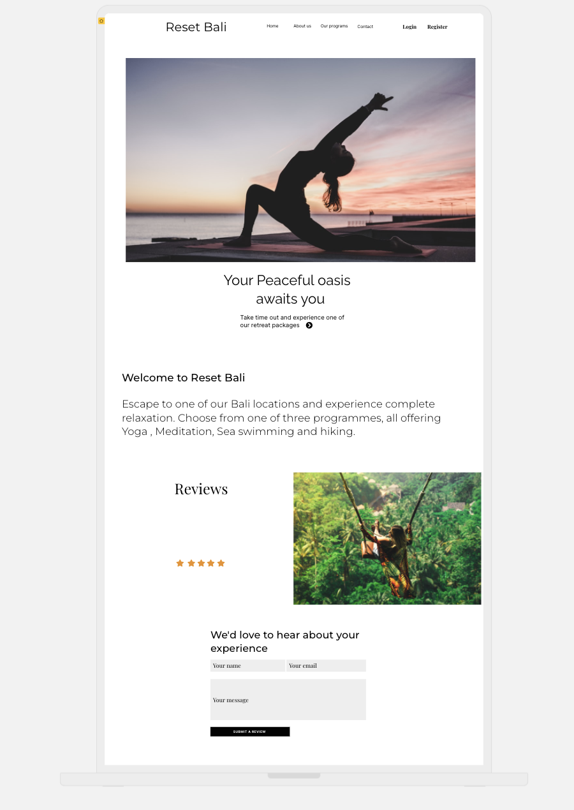

<h4> locations and programmes </h4>

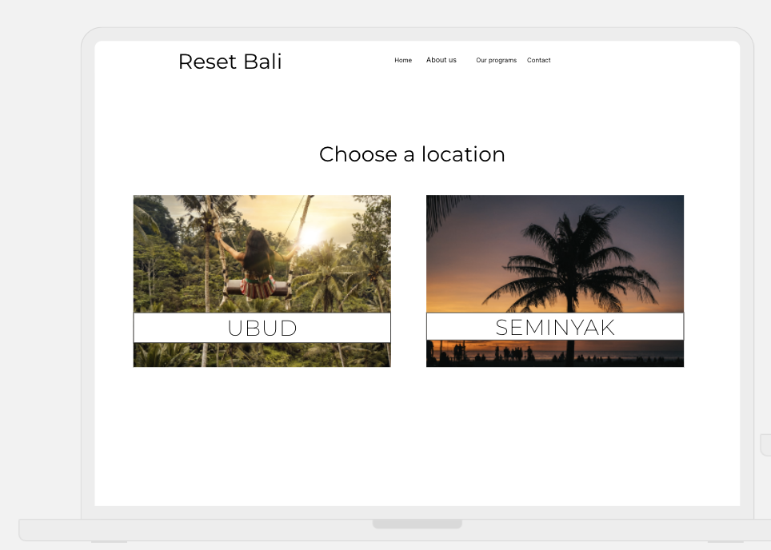

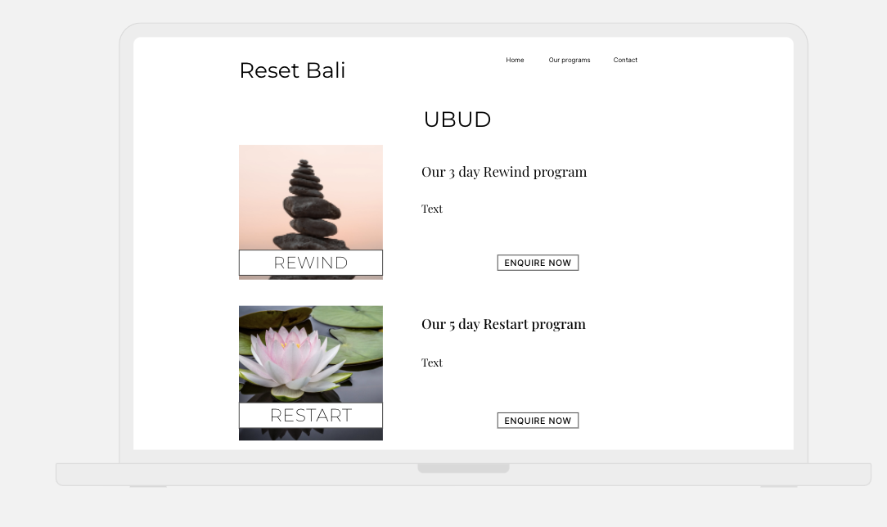

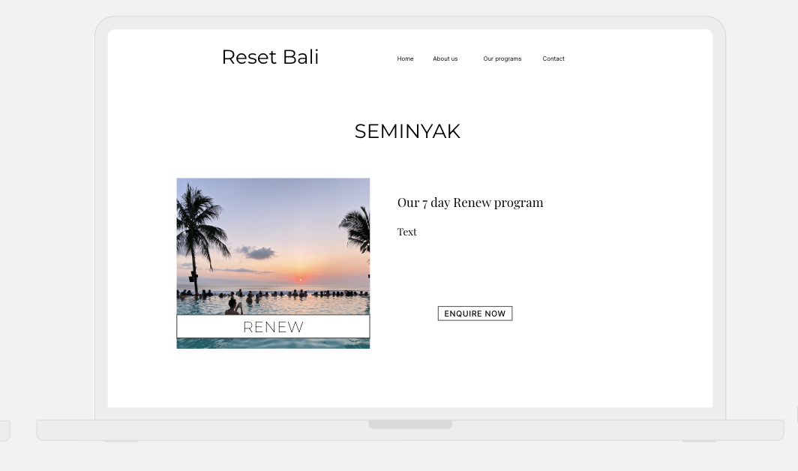

<h4> Reservations </h4>

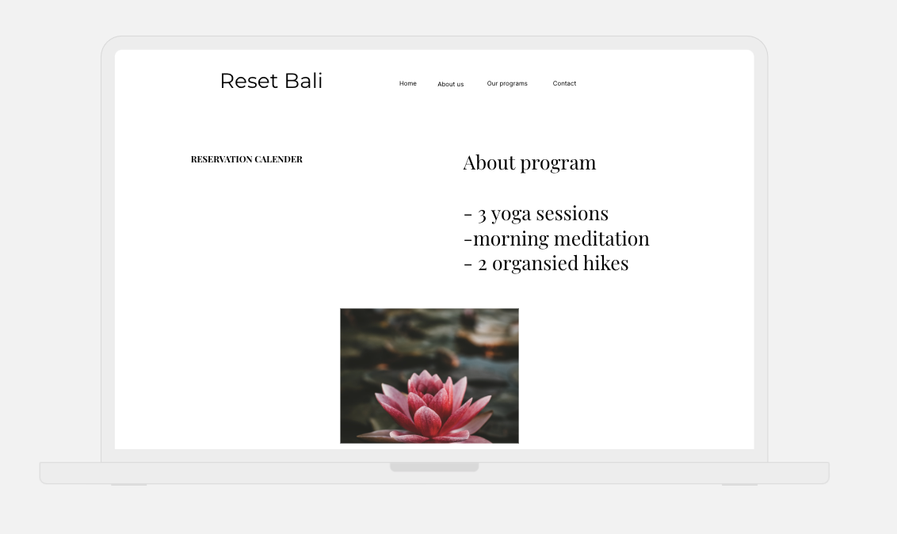

<h4> Contact us </h4>

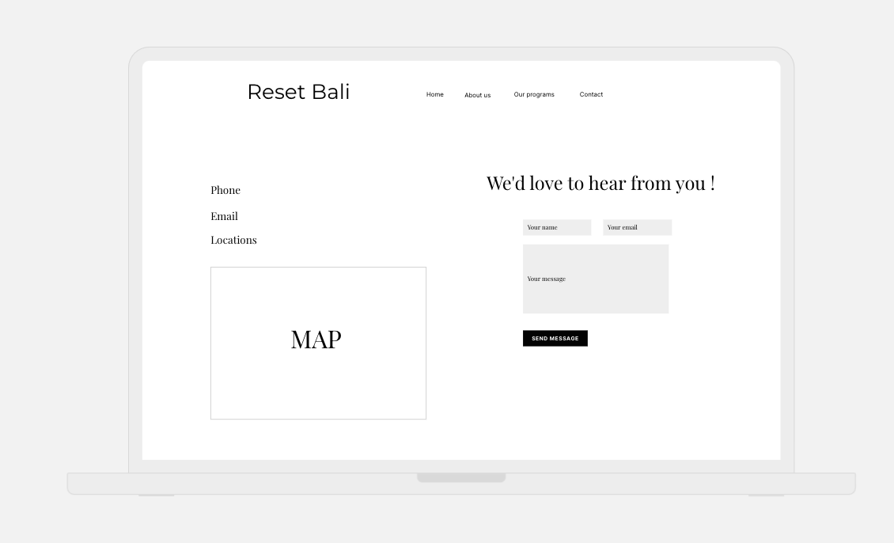

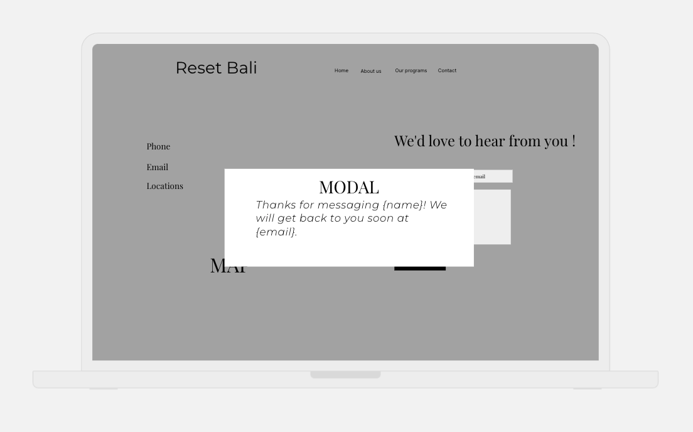

<h1> Features </h1>
<h3> Existing Features </h3>

<h2> Home app </h2>

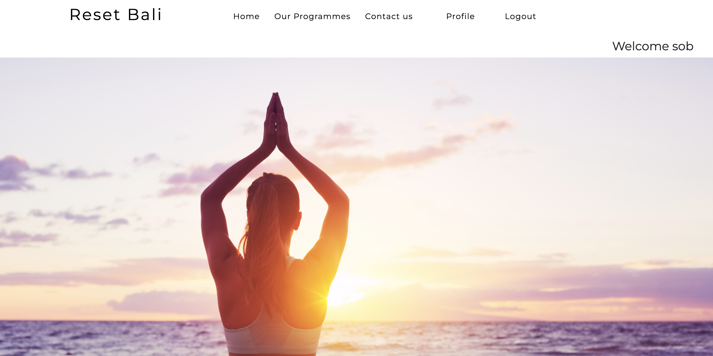

The user is greeted by an eye catching hero image as soon as they land onto the site. It instantly sets the tone of what the site is going to offer the user.

Just below the the hero image, we have a short but sweet tag line that conveys the programmes on offer as "an oasis of peace". This further informs the user and sets the vibe of the site. 
When a user logs in, they will be redirected to the home page with a 'welcome "user"' message.
The navbar remains the same throughout the site, except for when a user is logged in, a 'profile' menu heading will appear while a 'login' and 'register' menu heading is observed when no user is logged in.

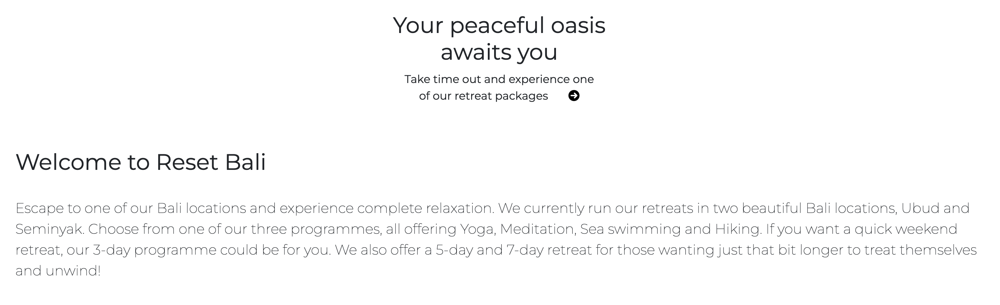

The site does not have an about page, and instead has a short synopsis of whats on offer. This combined with the main feature - the testimonial slider, gives the user plenty of information, while also wanting to learn more and look further into the site.

<h2> Reviews and testimonial slider </h2>
One of the main models of the site is the reviews model. Not only can the user submit a review, the can also see it appear on a carousel styled slider.

This is a nice feature to have, as testimonials from previous attendees that have experienced the program can give insight into their experience, which has a big influence on the user. 
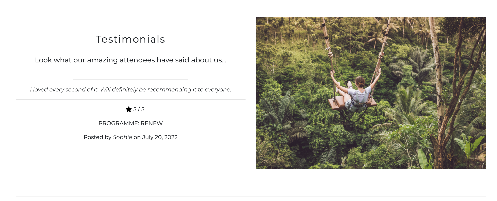

Below the slider we have the user review form in which a logged in user can post their own review of their experience. Basic fields are provided in which the user has to select the programme they attended, give their testimonial and rate the programme out of 5. This information is then submitted to the database through the review form model and that information is rendered through to the above review slider.

<h2> Programmes app </h2>
The website offers the user a selection of three programmes, each differing in length and also location. The user can check out the locations on offer first.

Ubud provides the user with two different retreats, rewind and restart.

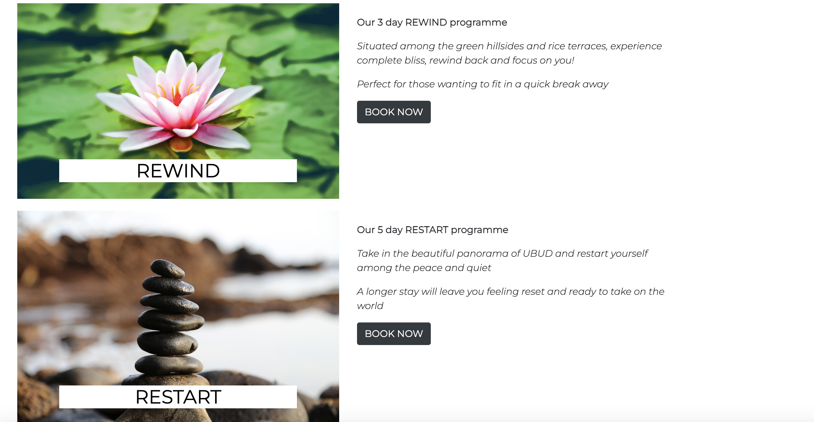

Seminyak has one programme - renew.

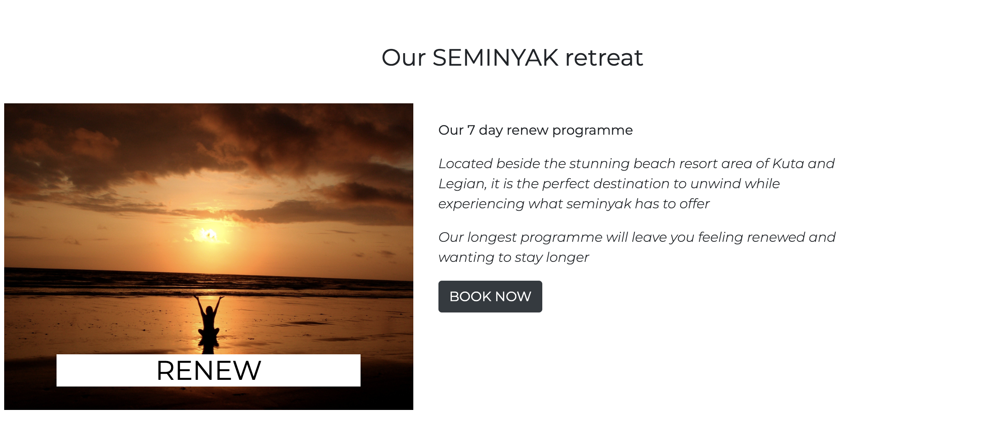

From here, the user can select one of the programmes to book. Each will bring you to a booking form, identical in model but with a different programme name and different dates to choose from. 

The user field cannot be edited by the user as it is fixed to the logged in users username. The programme field is also fixed to the programme that is being booked on each page. Along side the booking model, we have a schedule from the current years programme. This further informs the user on whats on offer, enticing them to book and experience it for themselves. 

<h2> Authenicated User </h2>

The 'django-allauth' python package was used on the site to create the login, logout, register and password-change features.

The two main model features of the site - the booking model and review model, can only be accessed by the user if they have an account and are logged in. 
The only form accessible by any user is the contact form. 

When a normal user goes to leave a review or book a program they will be shown a message to login or register to show content.

This allows user filtered content to be displayed to the user, but also entices a user to register an account so that they can see hidden content.

<h2> Profile </h2>
A logged in user can view their profile which provides them with three options. The user can view current bookings that they have, reviews they have submitted and it also gives them the option to change their password.

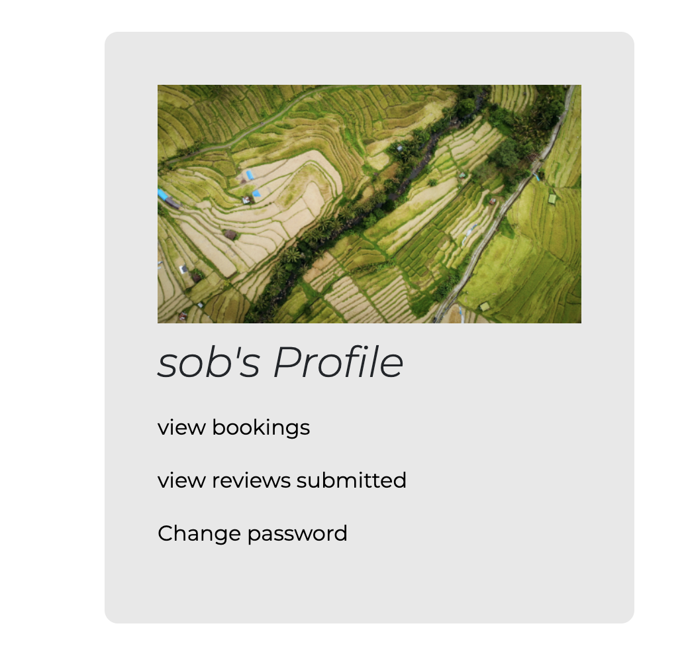

<h2> CRUD </h2>

CRUD is huge in all websites today, allowing users to create, read, update and delete. The two models shown on the reset bali site allow the user to do just that. 
The user can view their bookings and reviews and also modify/delete them from their profile.

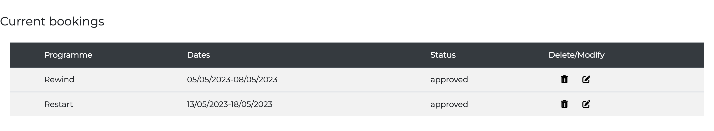

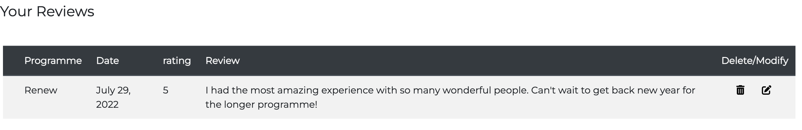

<h2> Contact app </h2>

The contact app provides a booking form model in which all users can contact the company. A map feature was also put in place with two markers for the two separate bali locations.

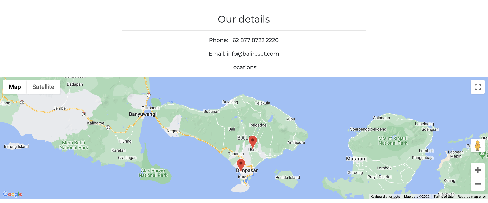

<h2> Future Features </h2>

<h4> Gallery app </h4>
- A feature that allows users to upload images from their time at Reset Bali
- A display page, to showcase all photos that can be liked by other users and commented on

<h4> Email feature </h4>
- The user would be emailed when they register an account, forgot their password, left a review or made a booking.

<h4> Payment feature </h4>
- The user could pay for their booking online, rather than at a later date.
- 
<h1> Technologies Used </h1>
<h3> Programming languages </h3>
  - HTML - HTML was widely used to provide the layout and content to the website.
  - CSS - CSS was needed to style all elements of the site
  - Python - All backend functions were carried out using python
  - Javascript - Custom Javascript was used in a number of features including the map feature.

 <h3> Database </h3>
 - Heroku Postgres 

<h1> Testing </h1>

<h2> Manual Testing </h2>
 
<h4> Code Validation </h4>
<h6> W3 validator - The HTML code was passed through and validated using the W3 validator.</h6>

<h6> W3 Jigsaw - All CSS code was validated using W3 Jigsaw </h6>

 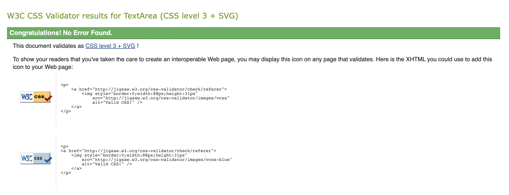
 
<h6> PEP8 - Validated all python code </h6>

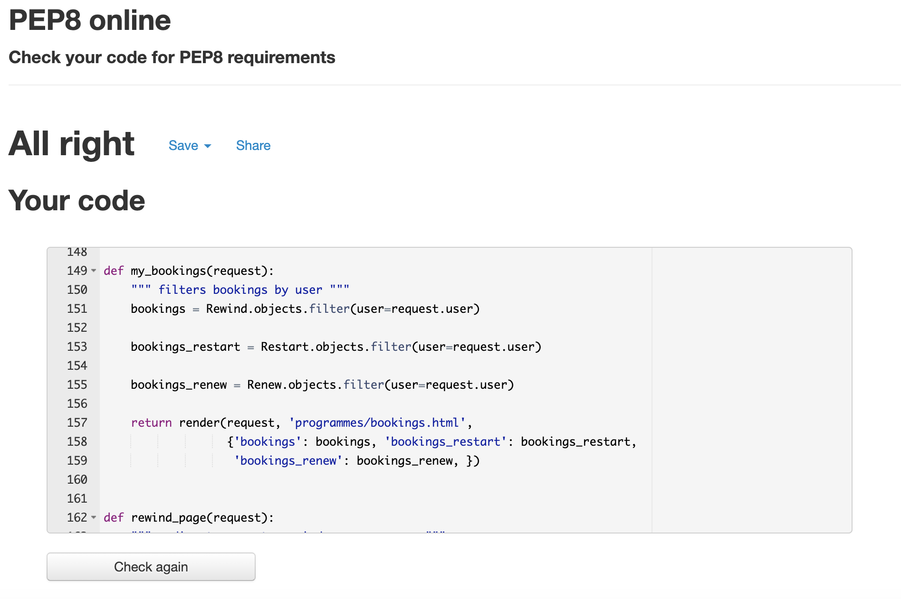
 
<h6> JS Hint - Javascript Code was validated through JS Hint </h6>

