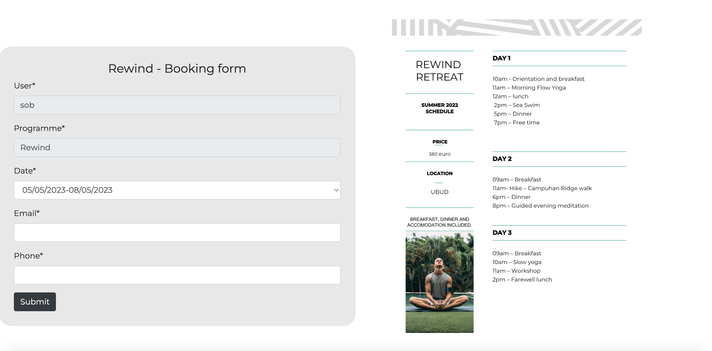
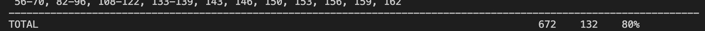

<h1> RESET BALI </h1>
<h3> Full stack project - PP4 </h3>

The RESET BALI application showcases an "oasis of peace" in the form of three wellness programmes. The programmes consist of a number of activities including yoga, meditation and guided hikes. 

Link to live website here

<h1> Table of Contents </h1>

- Project Summary
- User Experience (UX)
  - User stories
  - The Strategy plane
  - The Scope plane
  - The Structure plane
  - The Skeleton plane
    - Site Mockup
 - Features
 - Existing Features
 - Future Features
 - Testing
 - Deployment
 - Credits

<h1> User Experience (UX) </h1>

<h2> User Stories </h2>

 - As a first time user, I want to easily navigate the site.
 - As a first time user, I want to be informed about the different programmes on offer.
 - As a first time user, I want to read testimonials from previous customers.
 - As a first time user, I want to register an account on the site.

- As a returning user, I want to log into my account.
- As a returning user, I want to reserve a spot on an upcoming program.
- As a returning user, I want to be able to contact the company.
- As a returning user, I want to submit a review.
 

<h2> The Strategy Plane </h2>

Reset Bali is a web application that informs the user of a wellness retreat based in two locations in Bali. The user can choose between the two locations, each location offering a different program, the reset, rewind and renew program. The user will be able to create an account, read reviews left by previous attendees and also book their slot in an upcoming programme of their choice. 

<h2> The Scope Plane </h2>

While planning the site design, I wanted to ensure the user could navigate easily throughout the site and easily get to other parts of the site from every page. In the plan for the site, I wanted it to be bright, clean and simple but also interactive to ensure a positive user experience. 

White and black were the main colours used throughout the site, offering that minimalistic tone. This allowed for no distractions when it came to the bold colourful images. 

<h2> The Structure Plane </h2>

Upon visting the site, the user will first see a striking hero image that depicts the theme of the site. Below the image, the user will get a little synopsis of what to expect from 'Reset Bali', followed by some detailed information to further inform the user. Near the end of the home page, the user will be able to view testimonials and past attendees will also be able to post reviews to the site. The Nav bar contains three sections, a link to the home page, the programmes page and a contact page. 

Once the user clicks on the link to the programmes, two locations will appear. The user can then choose the location of choice and the available programmes at that location will appear. The user can then then find more information on each programme and also have the option to book a space for an available date. Pricing and programme schedule will also be displayed.

The Contact page will contain a standard 'contact us' form for the user to reach out if needed. Phone and email details aswell as the two locations are detailed to the user.

<h2> The Skeleton Plane </h2>
 <h3> Site Mockups </h3>
<h4> Home page </h4>

<h4> locations and programmes </h4>

<h4> Reservations </h4>

<h4> Contact us </h4>

<h3> Database Models </h3>

<h4> Review model </h4>

<table>
  <tr>
    <th> Name </th>
    <th> Database key</th>
    <th> Field Type</th> 
    <th> Default </th>
  </tr>
  <tr>
    <td> Name </td>
    <td> name </td>
    <td> Charfield</td>
    <td> (logged in user autofilled)
  </tr>
    <tr>
    <td> Date </td>
    <td> date </td>
    <td> DateField </td>
    <td> automatic</td>
  </tr>
  <tr>
    <td> Programme </td>
    <td> programme_attended</td>
    <td> ChariFeld </td>
    <td> (choice dropdown)
  </tr>
  <tr>
    <td> Your review </td>
    <td> your_experience </td>
    <td> Textfield</td>
    <td> blank </td>
  </tr>
  <tr>
    <td> Rating </td>
    <td> rating </td>
    <td> Integerfield</td>
    <td> blank </td>
  </tr>  
  
</table>

<h4> Booking model </h4>

<table>
  <tr>
    <th> Name </th>
    <th> Database key</th>
    <th> Field Type</th>
    <th> Default </th>
  </tr>
  <tr>
    <td> User </td>
    <td> user </td>
    <td> Charfield</td>
    <td> (logged in user autofilled)
  </tr>
  <tr>
    <td> Programme </td>
    <td> programme </td>
    <td> Charfield </td>
    <td> (programme autofilled) </td>
  </tr>
  <tr>
    <td> Date </td>
    <td> date </td>
    <td> Charfield</td>
    <td> (choice dropdown) </td>
  </tr>
  <tr>
    <td> Status </td>
    <td> status </td>
    <td> CharField</td>
    <td> blank </td>
  </tr> 
  <tr>
    <td> Phone </td>
    <td> phone </td>
    <td> integerfield</td>
    <td> blank </td>
  </tr>
  <tr>
    <td> Email </td>
    <td> email </td>
    <td> EmailField</td>
    <td> blank </td>
  </tr> 
 </table>
 
<h1> Features </h1>
<h3> Existing Features </h3>

<h2> Home app </h2>

The user is greeted by an eye catching hero image as soon as they land onto the site. It instantly sets the tone of what the site is going to offer the user.

Just below the the hero image, we have a short but sweet tag line that conveys the programmes on offer as "an oasis of peace". This further informs the user and sets the vibe of the site. 
When a user logs in, they will be redirected to the home page with a 'welcome "user"' message.
The navbar remains the same throughout the site, except for when a user is logged in, a 'profile' menu heading will appear while a 'login' and 'register' menu heading is observed when no user is logged in.

The site does not have an about page, and instead has a short synopsis of whats on offer. This combined with the main feature - the testimonial slider, gives the user plenty of information, while also wanting to learn more and look further into the site.

<h2> Reviews and testimonial slider </h2>
One of the main models of the site is the reviews model. Not only can the user submit a review, the can also see it appear on a carousel styled slider.

This is a nice feature to have, as testimonials from previous attendees that have experienced the program can give insight into their experience, which has a big influence on the user. 

Below the slider we have the user review form in which a logged in user can post their own review of their experience. Basic fields are provided in which the user has to select the programme they attended, give their testimonial and rate the programme out of 5. This information is then submitted to the database through the review form model and that information is rendered through to the above review slider.

<h2> Programmes app </h2>
The website offers the user a selection of three programmes, each differing in length and also location. The user can check out the locations on offer first.

Ubud provides the user with two different retreats, rewind and restart.

Seminyak has one programme - renew.

From here, the user can select one of the programmes to book. Each will bring you to a booking form, identical in model but with a different programme name and different dates to choose from. 

The user field cannot be edited by the user as it is fixed to the logged in users username. The programme field is also fixed to the programme that is being booked on each page. Along side the booking model, we have a schedule from the current years programme. This further informs the user on whats on offer, enticing them to book and experience it for themselves. 

<h2> Authenicated User </h2>

The 'django-allauth' python package was used on the site to create the login, logout, register and password-change features.

The two main model features of the site - the booking model and review model, can only be accessed by the user if they have an account and are logged in. 
The only form accessible by any user is the contact form. 

When a normal user goes to leave a review or book a program they will be shown a message to login or register to show content.

This allows user filtered content to be displayed to the user, but also entices a user to register an account so that they can see hidden content.

<h2> Profile </h2>
A logged in user can view their profile which provides them with three options. The user can view current bookings that they have, reviews they have submitted and it also gives them the option to change their password.

<h2> CRUD </h2>

CRUD is huge in all websites today, allowing users to create, read, update and delete. The two models shown on the reset bali site allow the user to do just that. 
The user can view their bookings and reviews and also modify/delete them from their profile.

<h2> Contact app </h2>

The contact app provides a booking form model in which all users can contact the company. A map feature was also put in place with two markers for the two separate bali locations.

<h2> Responsive Design </h2> 

Bootstrap and media queries were used for a responsive design throughout the site.

<h2> Future Features </h2>

<h4> Gallery app </h4>
- A feature that allows users to upload images from their time at Reset Bali
- A display page, to showcase all photos that can be liked by other users and commented on

<h4> Email feature </h4>
- The user would be emailed when they register an account, forgot their password, left a review or made a booking.

<h4> Payment feature </h4>
- The user could pay for their booking online, rather than at a later date.
- 
<h1> Technologies Used </h1>

-   [Font Awesome](https://fontawesome.com/)
    * Font awesome icons were used on the site for the social media icons in the footer aswell as the delete/modify icons
  
-  Google Fonts
   * Both fonts that I used through the site were taken from google fonts.
  
-  Techsini
   * A multi device image was generated on [techsini.com](https://techsini.com/multi-mockup/)  
  
-  W3C, CSS, PEP8, JShint
   * I used the [HTML](https://validator.w3.org/) , [CSS](https://jigsaw.w3.org/css-validator/), [Python](http://pep8online.com/) and [JS](https://jshint.com/) online validators to validate my code and ensure there were no errors. 
  
-  Favicon
   * I uploaded an image to favicon which created a usable icon for my site.
  
- Google chrome- dev tools
  * Devtools from google chrome was used heavily during the project while styling the project and while adding media queries.
  
- Google maps - API

- Heroku
  * Heroku was used to deploy the site

<h3> Programming languages </h3>

- HTML - HTML was widely used to provide the layout and content to the website.

- CSS - CSS was needed to style all elements of the site

- Python - All backend functions were carried out using python

- Javascript - Custom Javascript was used in a number of features including the map feature.

<h3> Frameworks and libraries </h3>

- Django - high-level Python web framework that encourages rapid development and clean, pragmatic design. Built by experienced developers. 

 - Bootstrap - Bootstrap is a free front-end framework for faster and easier web development
Bootstrap includes HTML and CSS based design templates for typography, forms, buttons, tables, navigation, modals, image carousels as well as optional JavaScript plugins

- jQuery - jQuery is a fast, small, and feature-rich JavaScript library

<h3> Database </h3>

- Heroku Postgres 
    * Heroku provides a PostgreSQL database. "PostgreSQL is a powerful, open source object-relational database system with over 30 years of active development that has earned it a strong reputation for reliability, feature robustness, and performance".

<h1> Testing </h1>

<h4> User Story Testing </h4>

- "As a first time user, I want to easily navigate the site."
  * The minimal look to the site allows the user to easily navigate between all pages on the site. The nav bar is always present at the top of the screen, allowing the user to always have the option to get to other parts of the site. 

- "As a first time user, I want to be informed about the different programmes on offer."
  * The user is informed about whats on offer as they land on the home page. Further into the site, the user can select from one of two locations and read more about three programmes that are available.

- "As a first time user, I want to read testimonials from previous customers."
  * The user can read testimonials through a testimonial slider when they arrive on the home page.

- "As a first time user, I want to register an account on the site."
  * The option to register an account can be seen through the 'register' button on the navigation bar. The user will be redirected to a form that they can fill in to register an account.
  
- "As a returning user, I want to log into my account."
  * The login button is found on the nav bar as soon as a user arrives onto the site. Once they have registered an account, they can login in through the login form.
  
- "As a returning user, I want to reserve a spot on an upcoming program."
  * A booking form is found on each of the three programme pages (once the user is logged in).  Through the form, a user can select an available date and book a spot which they can then amend or delete afterwards through their profile.
  
- "As a returning user, I want to be able to contact the company."
  * The user, logged in or not can contact the company through a contact form on the contact page. Other contact details are found there also.
  
- "As a returning user, I want to submit a review."
  * A review form is found on the home page. The form allows the user to submit a review and view their review in the above testimonial carousel.

<h4> Manual Testing </h4>

<h5> The site </h5>

I carried out a large number of manual tests to ensure the site navigation and all features worked as they were intended to. 

- Navigation was checked by ensuring all links brought the user to the intended part of the site.

- Buttons, used to submit forms and anchor elements used for both links on the site and social media links in the footer were checked.

- Responsiveness was checked through googles Chrome Dev tools and through my own devices to make sure the site looked well on all screen sizes 

- The site was tested on google chrome, safari and microsoft edge. 

<h5> The database models </h5>
I carried out a number of manual tests to ensure the the database models worked effectively, that all information submitted was sent to the database and then accessed, and brought to the front end.

- The review form model was tested, ensuring the review information was saved and then that data was used to display in a review slider, which was also tested to ensure it rendered effectively.

- I ensured that the information stored could be modified or deleted by the user that had created that information by testing the modify and delete functions found in the 'my bookings' and 'my reviews' section in the users profile.

- Similarly , with the booking model, I ensured that the booking information submitted through each of the booking forms was stored effectively. This information was then passed through to the bookings section of the users profile where it could also be modifed or deleted by the user who created that information.

<h4> Automated </h4>
  - I created a number of tests in the tests.py files to test my urls, views and models. 
  - I installed and ran the 'coverage' tool which informs you how much of your code you have tested
  - I revieved a score of 80%.
  
   
 
<h4> Code Validation </h4>
All code was ran through online validation services to ensure all code was valid and free from errors.

<h6> W3 validator - The HTML code was passed through and validated using the W3 validator.</h6>

<h6> W3 Jigsaw - All CSS code was validated using W3 Jigsaw </h6>

 
 
<h6> PEP8 - Validated all python code </h6>

 
<h6> JS Hint - Javascript Code was validated through JS Hint </h6>

<h6> WAVE Web Accessibility Evaluation Tool </h6>
I used the wave tool to check for contrast errors. There were no issues, all tests passing.

<h1> Deployment </h1>
- This project was created in gitpod and deployed using Heroku.

- A number of steps were carried out to ensure a successful deployment.

- The final code was pushed to github and then heroku was used.

- On the Heroku website, log in to your account once signed up.

- Click on "create new app" once logged in.

- Give the app a name and choose the correct region, USA or Europe

- Click on the settings tab

- Once in settings, go to the "Config Vars" and add the KEY:PORT and the VALUE:8000

- After, go to the "buildpacks" section and add buildbacks 'Python'.

- Go to the deployment section and click on the 'connect to Github' option

- Choose the repository name you want to deploy and click 'connect'.

- Choose between the 'automatic' and 'manual' deploys
 
- Finally select the branch to deploy and heroku will build the final live app.

<h1> Credits </h1>

- Images were from pixabay and deposit photos
- codemy.com on you tube for some handy tips
- Font awesome

<h1> Acknowledgements </h1>
- My mentor Narender Singh for his advice and guidance
- All tutors that provided help at the code Institute - Tutor support
- Family members who tested the site

